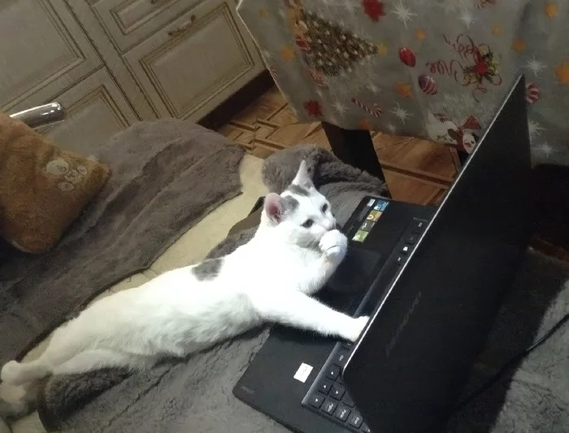

# PORTFOLIO

### О себе

Я начинающий **frontend-разработчик** с базой в естественных науках: по образованию я биолог. Мой переход в программирование начался с увлечения созданием веб-приложений и визуальным дизайном. Благодаря аналитическому подходу к решению задач и стремлению к красивым и функциональным интерфейсам, я быстро освоила основы разработки и работаю над новыми проектами, чтобы расширить свой технический стек.

**Ключевые навыки**
- HTML/CSS
- JavaScript
- React
- Git/GitHub
- Основы UI/UX дизайна

**Дополнительные навыки**
- Навыки рисования: Увлечение изобразительным искусством и анимацией позволяет мне создавать визуально привлекательные элементы и стремиться к эстетике в дизайне.
- Аналитическое мышление: Научный опыт помогает мне подходить к программированию как к решению комплексных задач и быстро адаптироваться к новым инструментам и технологиям.

**Примеры проектов**
- Интернет магазин художественных товаров (art-store)
- Личный сайт-портфолио
- Личный сайт с арт-портфолио
- Интерактивный To-Do список

**Цели**
Хочу развиваться в направлении frontend-разработки, а также углубить навыки работы с анимациями и визуальными эффектами. Интересуюсь разработкой UI/UX-дизайна, чтобы создавать функциональные и визуально привлекательные интерфейсы.